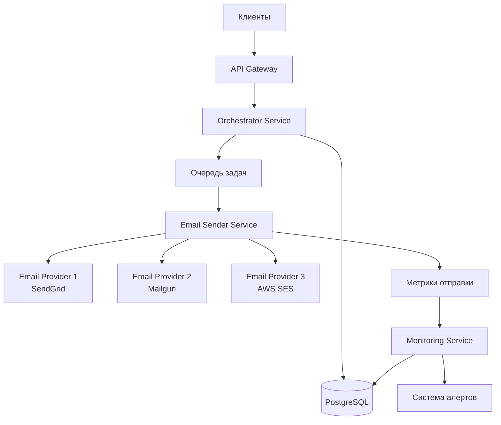
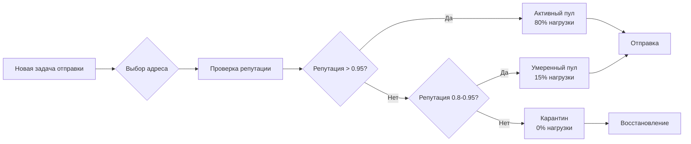
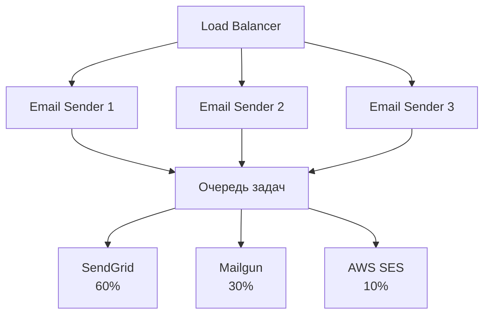

# Архитектура системы email-аутрича для 1200 адресов

## Описание архитектуры

Архитектура построена на принципах микросервисов с использованием облачных сервисов российских провайдеров. Система обеспечивает мультитенантность (поддержку нескольких клиентов), изоляцию направлений (кампаний) и автоматическую ротацию email-адресов для поддержания высокой репутации и доставляемости.

### Компоненты системы

1. **API Gateway** — единая точка входа для всех запросов
2. **Orchestrator Service** — управление ротацией и распределением нагрузки
3. **Email Sender Service** — отправка писем через различные провайдеры
4. **Monitoring Service** — мониторинг репутации и метрик
5. **Database** — хранение метаданных адресов, клиентов и кампаний
6. **Queue System** — асинхронная обработка задач отправки

## Используемые сервисы и подходы

### Инфраструктура (Yandex Cloud)

- **Compute Cloud (VM)** — виртуальные машины для сервисов:
  - 2× s2.micro (2 vCPU, 8 GB RAM) — для API Gateway и Orchestrator
  - 2× s2.small (4 vCPU, 16 GB RAM) — для Email Sender Service
  - 1× s2.micro — для Monitoring Service
- **Managed PostgreSQL** — база данных для метаданных
- **Object Storage** — хранение логов и резервных копий
- **Application Load Balancer** — распределение нагрузки

### Email-провайдеры (мультипровайдерный подход)

- **SendGrid** — основной провайдер (600 адресов)
- **Mailgun** — резервный провайдер (400 адресов)
- **AWS SES** — дополнительный провайдер (200 адресов)

### Подходы

1. **Мультитенантность**: изоляция данных клиентов через схемы БД и маршрутизацию
2. **Ротация адресов**: алгоритм на основе метрик репутации и лимитов отправки
3. **Graceful degradation**: автоматическое переключение между провайдерами при сбоях
4. **Rate limiting**: контроль скорости отправки для каждого адреса и провайдера

## Ротация и мониторинг

### Ротация email-адресов

Ротация реализована через **Orchestrator Service**, который:

1. **Анализирует метрики** каждого адреса:
   - Открытия писем (open rate)
   - Клики (click rate)
   - Жалобы (complaint rate)
   - Блокировки (bounce rate)
   - Лимиты провайдера

2. **Применяет алгоритм ротации**:
   - Адреса с репутацией > 0.95 используются активно (80% нагрузки)
   - Адреса с репутацией 0.8–0.95 — умеренно (15% нагрузки)
   - Адреса с репутацией < 0.8 — временно исключаются до восстановления

3. **Распределяет по направлениям**:
   - Каждое направление (кампания) привязано к пулу адресов
   - Ротация внутри пула предотвращает перегрузку

### Мониторинг

**Monitoring Service** собирает метрики в реальном времени:

- **Репутация адресов**: расчет на основе последних 1000 отправок
- **Лимиты провайдеров**: отслеживание квот и rate limits
- **Доставляемость**: процент успешных доставок
- **Производительность**: время ответа провайдеров

**Алертинг**:
- Telegram-бот для критических алертов
- Email-уведомления для администраторов
- Дашборд в Grafana (опционально)

**Автоматические действия**:
- При complaint rate > 1% — адрес переводится в карантин на 24 часа
- При bounce rate > 5% — адрес исключается из ротации на 48 часов
- При недоступности провайдера — автоматическое переключение на резервный

## Распределение нагрузки

### Горизонтальное масштабирование

- **Email Sender Service** работает в режиме нескольких инстансов (2–4 VM)
- **Load Balancer** распределяет задачи отправки между инстансами
- **Очередь задач** (Redis/RabbitMQ) обеспечивает равномерное распределение

### Вертикальное распределение

1. **По клиентам**: каждый клиент имеет выделенный пул адресов (изоляция)
2. **По направлениям**: направления распределены между адресами с учетом тематики
3. **По провайдерам**: нагрузка распределена 60/30/10 между SendGrid/Mailgun/AWS SES

### Rate Limiting

- **На уровне адреса**: максимум 50 писем/час на адрес
- **На уровне провайдера**: соблюдение лимитов API провайдеров
- **На уровне клиента**: лимиты согласно тарифному плану

## Риски и способы их закрытия

### Риск 1: Блокировка email-адресов провайдерами

**Способы закрытия**:
- Мультипровайдерный подход (3 провайдера)
- Строгий контроль репутации (автоматический карантин)
- Варминг-процедуры для новых адресов (постепенное увеличение объема)
- Использование SPF, DKIM, DMARC для аутентификации

### Риск 2: Превышение лимитов провайдеров

**Способы закрытия**:
- Мониторинг квот в реальном времени
- Автоматическое переключение на резервный провайдер
- Очередь задач с приоритизацией
- Буферизация при пиковых нагрузках

### Риск 3: Сбой инфраструктуры

**Способы закрытия**:
- Развертывание в нескольких зонах доступности (Yandex Cloud)
- Автоматический failover между VM
- Резервное копирование БД каждые 6 часов
- Health checks и автоматический перезапуск сервисов

### Риск 4: Утечка данных клиентов

**Способы закрытия**:
- Шифрование данных в БД (TLS)
- Изоляция данных клиентов на уровне схем БД
- Логирование доступа к данным
- Регулярные аудиты безопасности

### Риск 5: Недостаточная производительность

**Способы закрытия**:
- Горизонтальное масштабирование (добавление VM)
- Кэширование метаданных в Redis
- Асинхронная обработка через очереди
- Оптимизация запросов к БД (индексы, connection pooling)

## Примерная оценка стоимости

### Инфраструктура Yandex Cloud (месяц)

| Сервис | Конфигурация | Стоимость (руб/мес) |
|--------|--------------|---------------------|
| Compute Cloud (VM) | 5× s2.micro/small | ~8,000 |
| Managed PostgreSQL | db.t2.micro (2 vCPU, 4 GB) | ~3,500 |
| Object Storage | 50 GB | ~150 |
| Application Load Balancer | Базовая конфигурация | ~1,200 |
| Итого инфраструктура | | **~12,850** |

### Email-провайдеры (месяц)

| Провайдер | Объем | Стоимость (руб/мес) |
|-----------|-------|---------------------|
| SendGrid | 100,000 писем | ~4,500 |
| Mailgun | 50,000 писем | ~3,200 |
| AWS SES | 50,000 писем | ~1,800 |
| Итого провайдеры | | **~9,500** |

### Дополнительные сервисы

| Сервис | Стоимость (руб/мес) |
|--------|---------------------|
| Мониторинг (Grafana Cloud) | ~1,500 |
| Резервное копирование | ~500 |
| Итого дополнительные | **~2,000** |

### **Общая стоимость: ~24,350 руб/мес**

*Примечание: стоимость может варьироваться в зависимости от реального объема отправок и выбранных тарифов провайдеров.*

## Оптимизация стоимости

1. **Использование spot-инстансов** для некритичных сервисов: экономия до 30%
2. **Резервирование VM** на год: скидка до 25%
3. **Переход на более дешевые провайдеры** при росте объема (например, AWS SES для больших объемов)
4. **Автоматическое масштабирование**: уменьшение количества VM в периоды низкой нагрузки